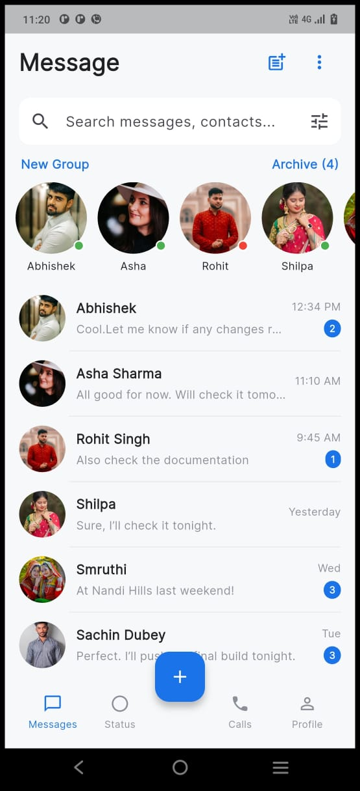
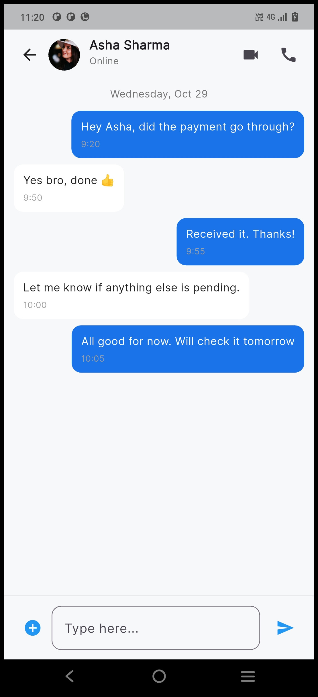
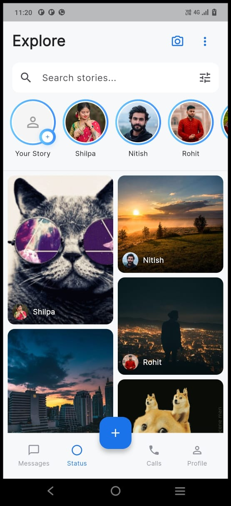
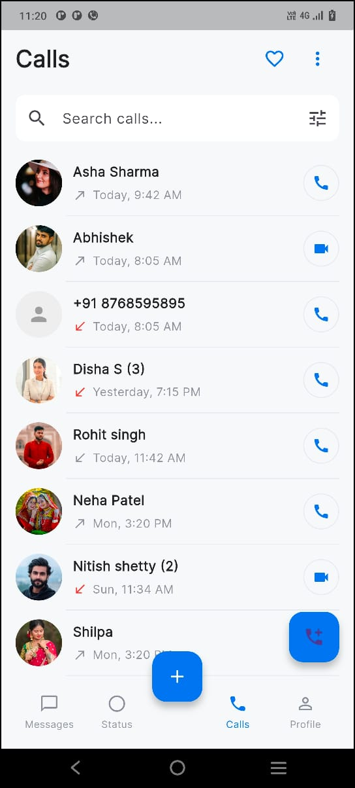
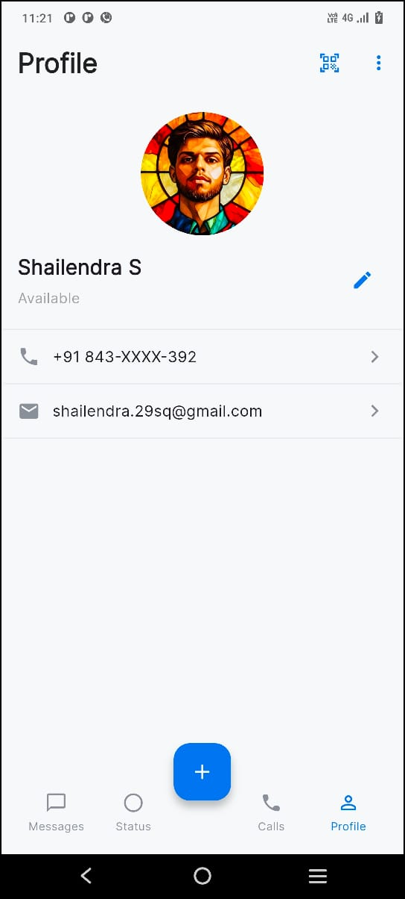

# ChatBox-App

A sleek Flutter messaging app featuring a conversations list, threaded chat interface, status view, call log, and user profile — delivering a clean, responsive UI, maintained navigation state, and a centralized theming system for consistent styling.

---

## 📸 Screenshots

- 
- 
- 
- 
- 

---

## 🚀 Features

- **Chat List Interface** — Displays user conversations with profile avatars, message previews, timestamps, and unread message indicators.
- **Smart Search Bar** — Allows quick filtering of chats and contacts directly within the message screen.
- **Chat Screen UI** — Threaded conversation view with text and file message bubbles, timestamps, and a clean message input field.
- **Status Screen** — Horizontal story avatars with user names and a dynamic grid layout for viewing shared images or GIF stories.
- **Calls Section** — UI layout for recent, incoming, and missed calls (prepared for call feature integration).
- **Profile Section** — Displays user avatar, name, and account information in a visually neat layout.
- **Consistent Theme System** — Centralized color and text styling for a uniform user experience across all screens.
- **Modular Architecture** — Each screen and widget is built separately for scalability, maintainability, and easy customization.
- **Optimized UI Performance** — Smooth navigation and efficient widget structure to ensure faster load times.

---

## 🛠️ Getting Started

1. Clone the repository or open your local project folder.
2. Install dependencies and generate app icons/splash screen:

```bash
flutter pub get
flutter pub run flutter_launcher_icons:main
flutter pub run flutter_native_splash:create
flutter run
```
